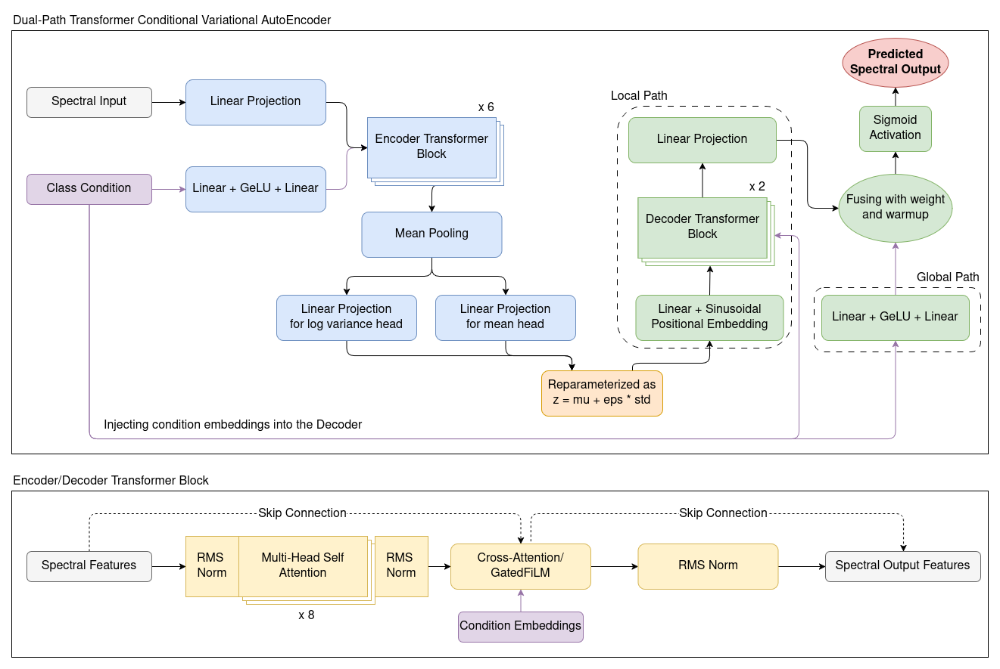
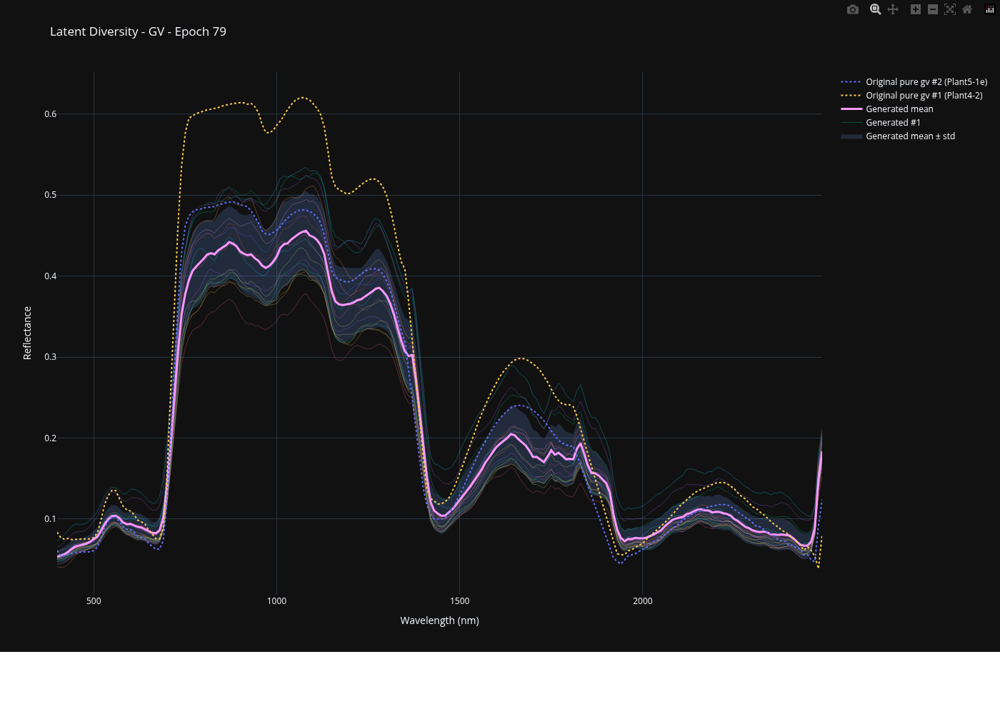
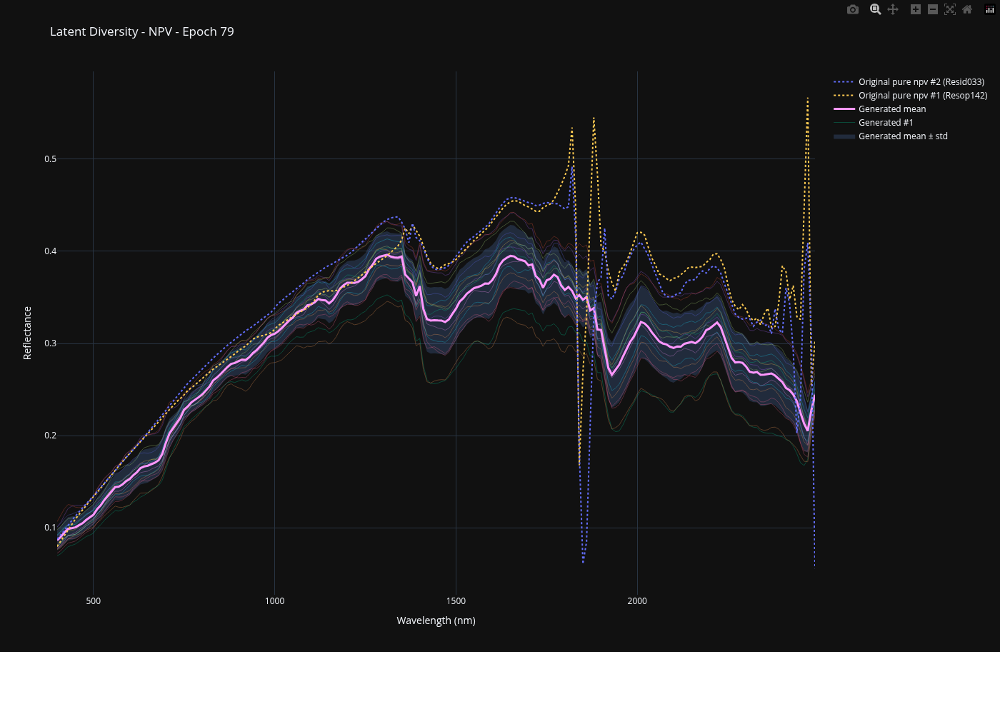
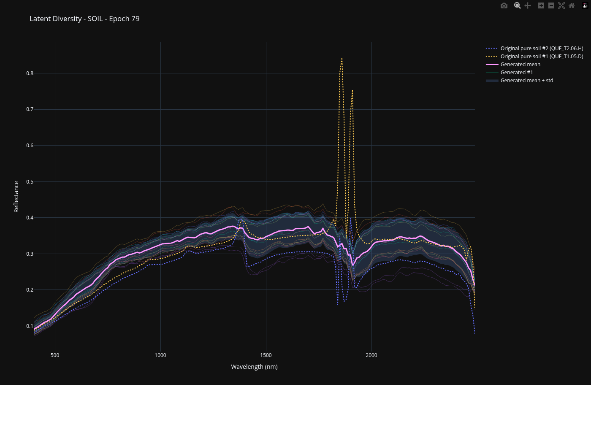

# HSI-CVAE

Conditional Variational AutoEncoder models for generating synthetic hyperspectral spectra for the FINCH satellite project at the University of Toronto Aerospace Team.

The final selected model in this repository is the **TCVAE**, implemented as a **Dual-Path Transformer Conditional Variational AutoEncoder**. After comparing multiple CVAE backbones, this model gave the best overall tradeoff between reconstruction quality, latent usage, and conditional spectral diversity.

For original repo used for development, see [Repo](https://github.com/Kyaw-Thiha/hsi-cvae).

## Final Model Selection

### Selected model
**TCVAE (Dual-Path Transformer Conditional Variational AutoEncoder)**

### Why this model was selected
Among the architectures evaluated in this repo, the TCVAE was selected because it:
- achieved the best validation performance in the final ablation family
- retained active latent dimensions instead of collapsing to a near-deterministic decoder
- preserved conditional variability better than the MLP and convolutional CVAE baselines
- produced the best balance between spectral fidelity and local stochastic structure

### Best run
- **Best run:** `run_K_lat12`
- **Best validation loss:** `0.0024`
- **Best checkpoint:** `outputs/checkpoints/best/e_epoch=37-l_val_loss=0.0024.ckpt`

### Final hyperparameters

| Hyperparameter | Value |
|---|---:|
| `latent_dim` | `12` |
| `d_model` | `128` |
| `n_heads` | `8` |
| `encoder_layers` | `6` |
| `decoder_layers` | `2` |
| `dropout` | `0.0` |
| `condition_dropout` | `0.35` |
| `decoder_use_film` | `true` |
| `gated_film_init` | `0.20` |
| `latent_fuse_weight` | `0.85` |
| `latent_fuse_weight_min` | `0.75` |
| `latent_fuse_weight_learnable` | `true` |
| `global_path_hidden_dim` | `32` |
| `global_path_dropout` | `0.50` |
| `global_path_warmup_hold_epochs` | `20` |
| `global_path_warmup_ramp_epochs` | `30` |
| `decoder_logit_gain` | `1.0` |
| Loss | `beta_vae` |
| Reconstruction loss | `mse` |
| `beta` | `0.02` |
| `free_bits_total` | `2.0` |
| `grad_weight` | phase-1 `0.0`, phase-2 `1.0` |
| `grad_diff_orders` | `[1, 2]` |
| `grad_order_weights` | `[1.0, 0.1]` |
| Optimizer | Adam |
| Learning rate | `2e-4` |
| Weight decay | `0.0` |
| Scheduler | cosine annealing |
| Batch size | `32` |
| Data split | `0.8 / 0.1 / 0.1` |
| Seed | `42` |

## Architecture

The final TCVAE architecture uses a dual-path decoder that separates:
- **global condition-driven structure**
- **local latent-driven stochastic detail**

This design was chosen to reduce decoder bypass and improve latent usage while preserving conditional spectral realism.



Further details:
- `docs/dual_path_transformer_cvae.md`
- `models/dual_path_transformer/cvae.py`

## Final Results

The final TCVAE was evaluated by conditioning on the three abundance components:
- **GV**
- **NPV**
- **Soil**

The plots below summarize the final model behavior for each conditional dimension.

### GV


Interactive / full HTML version: [`docs/tcvae_gv.html`](docs/tcvae_gv.html)

### NPV


Interactive / full HTML version: [`docs/tcvae_npv.html`](docs/tcvae_npv.html)

### Soil


Interactive / full HTML version: [`docs/tcvae_soil.html`](docs/tcvae_soil.html)

## Other Models Tried

Before selecting the TCVAE, several alternative CVAE backbones were evaluated.

| Model | Outcome | Main issue |
|---|---|---|
| MLP CVAE | Not selected | Over-smoothed spectra; failed to preserve realistic local variability |
| Convolutional CVAE | Not selected | Over-smoothed spectra; weak local noise modeling |
| Earlier transformer CVAE variants | Not selected | Frequent posterior collapse or weak latent usage |
| Dual-Path Transformer TCVAE | **Selected** | Best balance of fidelity, latent usage, and conditional diversity |

### Summary of failure modes
Most non-selected models fell into one of two categories:

1. **Model collapse / posterior collapse**
   - the decoder produced plausible spectra while the latent pathway became weak or inactive
   - KL objective and active latent dimensions often collapsed toward zero

2. **Over-smoothing**
   - the model learned the conditional mean structure
   - but failed to reproduce realistic local stochastic variation
   - this was most visible in the MLP and convolutional CVAE baselines

The final TCVAE was the strongest model because it mitigated collapse substantially while preserving more local spectral diversity than the simpler baselines.

## Notes and Limitations

The final TCVAE is the strongest model found in this project, but it is not perfect.

Current limitations:
- prior sampling can still be slightly under-dispersed relative to real held-out spectra
- tail behavior and sharp local variability remain harder to reproduce than mean structure
- latent usage was strongly improved, but not every architecture and hyperparameter regime was stable

During downstream analysis, the TCVAE showed the best tradeoff overall, but calibrated sampling temperature was still useful when matching real conditional variability.

## Reproducibility

The final selected recipe is the `run_K_lat12` family. Training was performed in two phases.

### Phase 1

```bash
python main.py fit \
  --config config/models/dual_path_transformer.yaml \
  --config config/losses/beta_vae.yaml \
  --config config/experiments/run_K_lat12_base.yaml \
  --config config/experiments/run_K_phase1_common.yaml \
  --trainer.default_root_dir outputs/ablations/run_K_lat12
```

### Phase 2

Resume from the phase-1 checkpoint and continue with the final phase-2 settings:

```bash
python main.py fit \
  --ckpt_path <phase1_ckpt> \
  --config config/models/dual_path_transformer.yaml \
  --config config/losses/beta_vae.yaml \
  --config config/experiments/run_K_lat12_base.yaml \
  --config config/experiments/run_K_phase2_grad1_beta002.yaml \
  --trainer.default_root_dir outputs/ablations/run_K_lat12
```

### Best checkpoint

```text
outputs/checkpoints/best/e_epoch=37-l_val_loss=0.0024.ckpt
```

## Installation

Create the environment:

```bash
conda create -n hsi-cvae python=3.13 -y
```

Activate it:

```bash
conda activate hsi-cvae
```

Install dependencies:

```bash
pip install -r requirements.txt
```

## Common Commands

### Train a model

```bash
python main.py fit --config config/models/mlp.yaml
```

Base configs load automatically:
- `config/base.yaml`
- `config/losses/beta_vae.yaml`

Model configs:
- MLP: `config/models/mlp.yaml`
- CNN: `config/models/cnn.yaml`
- Transformer: `config/models/transformer.yaml`
- Transformer Repeat-Z: `config/models/transformer_repeatz.yaml`
- Dual-Path Transformer: `config/models/dual_path_transformer.yaml`
- Conformer: `config/models/conformer.yaml`

### Train the final TCVAE recipe

Example pattern:

```bash
python main.py fit \
  --config config/models/dual_path_transformer.yaml \
  --config config/losses/beta_vae.yaml \
  --config config/experiments/run_K_lat12_base.yaml \
  --config config/experiments/run_K_phase1_common.yaml
```

Phase-2 continuation pattern:

```bash
python main.py fit \
  --ckpt_path <phase1_ckpt> \
  --config config/models/dual_path_transformer.yaml \
  --config config/losses/beta_vae.yaml \
  --config config/experiments/run_K_phase2_grad1_beta002.yaml
```

### Resume training from a checkpoint

```bash
python main.py fit --config config/models/mlp.yaml --ckpt_path runs/train_/checkpoints/interval/hsdt-epoch10.ckpt
```

### Predict / sample

Predict automatically includes:
- `config/base.yaml`
- `config/losses/beta_vae.yaml`
- `config/predict.yaml`

Examples:

```bash
python main.py predict --config config/models/transformer.yaml --config config/predict/half.yaml --ckpt_path outputs/run/checkpoints/best/transformer.ckpt
```

```bash
python main.py predict --config config/models/conformer.yaml --config config/predict/training.yaml --ckpt_path outputs/run/checkpoints/best/conformer.ckpt
```

### Visualize the original dataset

```bash
python -m callbacks.original_line_charts
```

### Smoke test

```bash
python main.py fit --config config/models/mlp.yaml --trainer.profiler=null --trainer.fast_dev_run=True
```

### Batch size finder

```bash
python main.py fit --config config/models/mlp.yaml --run_batch_size_finder true --batch_size_finder_mode power
```

### Learning rate finder

```bash
python main.py fit --config config/models/mlp.yaml --run_lr_finder true
```

## Config Notes

### MLP configs
- `config/models/mlp/mlp_5m.yaml`
- `config/models/mlp/mlp_10m.yaml`
- `config/models/mlp/mlp_20m.yaml`
- `config/models/mlp/mlp_40m.yaml`
- `config/models/mlp/mlp_80m.yaml`

### CNN configs
- `config/models/cnn/cnn_5m.yaml`
- `config/models/cnn/cnn_10m.yaml`
- `config/models/cnn/cnn_20m.yaml`
- `config/models/cnn/cnn_40m.yaml`
- `config/models/cnn/cnn_80m.yaml`

### Final TCVAE references
- `config/models/dual_path_transformer.yaml`
- `config/losses/beta_vae.yaml`
- `config/experiments/run_K_lat12_base.yaml`
- `config/experiments/run_K_phase1_common.yaml`
- `config/experiments/run_K_phase2_grad1_beta002.yaml`
- `docs/latent_usage_ablation.md`
- `docs/dual_path_transformer_cvae.md`
